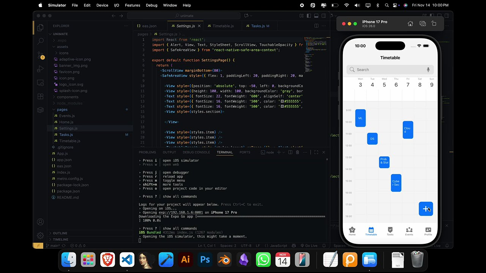

<p align="center">
  <a href="" target="_blank">
    
  </a>
</p>

# Unimate
A centralized application that allows students to effectively manage their academics as well as their extracurriculars by compiling and managing the data already spread out in emails, websites, and classrooms.

---
# DEMO VIDEO (click on the image)
[](https://www.youtube.com/watch?v=ZSfOvq54U0Y)

---
# Install
Go to package releases and download the latest android apk release file (right now only android application is released although iOS is supported)

Or just click on this link https://github.com/sol4nki/unimate/releases/tag/v0.1.0-alpha

if you own an iOS or you just want to compile it on your own then, proceed with the Requirements and steps below ->

---
# Requirements 

Make sure you have git -> https://git-scm.com/install/

Make sure you have node -> https://nodejs.org/en/download/

---
## Now proceed to run the following commands in the same order

```bash
git clone https://github.com/sol4nki/unimate
```

```bash
cd unimate
```

```bash
node -v
```

Now you just need to download expo go from PlayStore or AppStore 

Now run
```bash
npm install 
```
(make sure you are in unimate directory before npm install)


finally run,

```bash
npx expo start 
```

You will get a qr code in terminal -> scan it using your mobile phone -> you will get a prompt to go to expo go app -> application will start in expo go just have some patience
